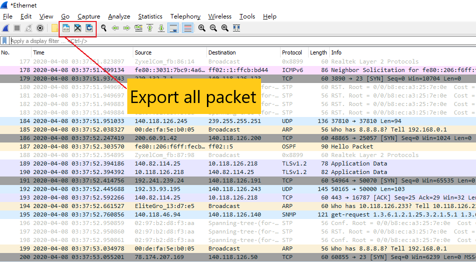

# HW2 zoom network packet simple forensics

## Wireshark install

### download
- windows or mac
  - https://www.wireshark.org/#download

- Linux
  - `sudo apt update`
  - `sudo apt install wireshark`

## Our goal

**Find zoom UDP packet transmission**

## 0x00 Understand wireshark

## 0x01 Find zoom application PID and binding port  

1. Open zoom application and join a conference room 
2. Start to record the packet by wireshark
3. find zoom PID
    - windows
      - open powershell
      - `ps | findstr "Zoom CptHost"`
    - mac
      - open terminal
      - `ps -ax | grep "zoom"`
4. find binding port
    - windows
      - open powershell
      - `netstat -ano | findstr "<pid>"`
    - mac
      - open terminal
      - `lsof -nP | grep <pid> | grep 'TCP\|UDP'`

## 0x02 Filter the UDP packets

**Please try to union three UDP ports**

## 0x03 Export pcap

Export the UDP packets

